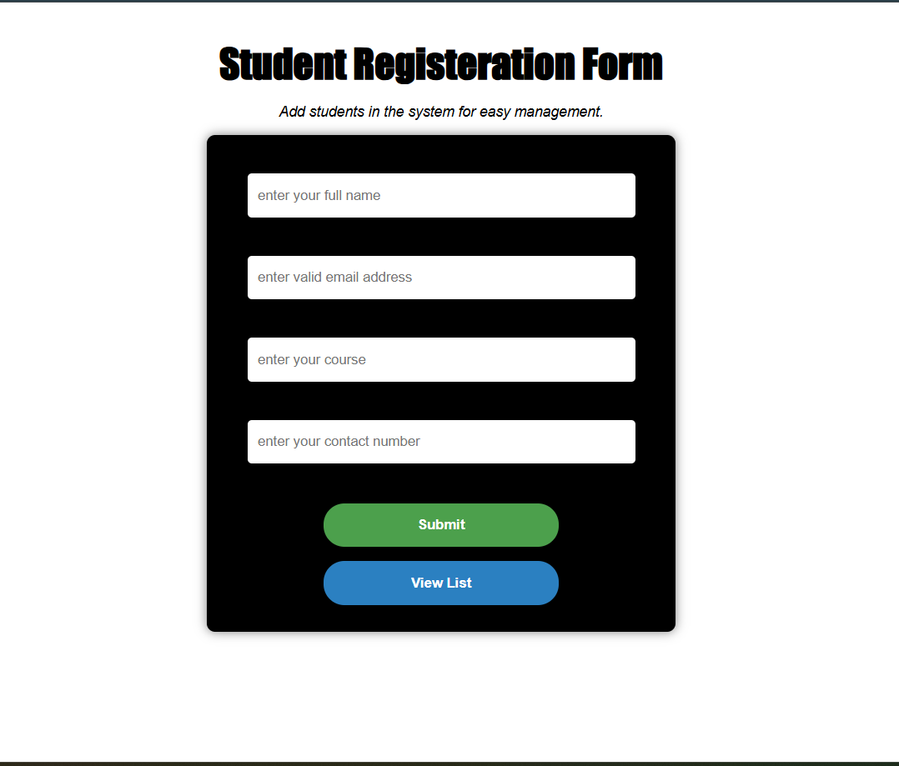
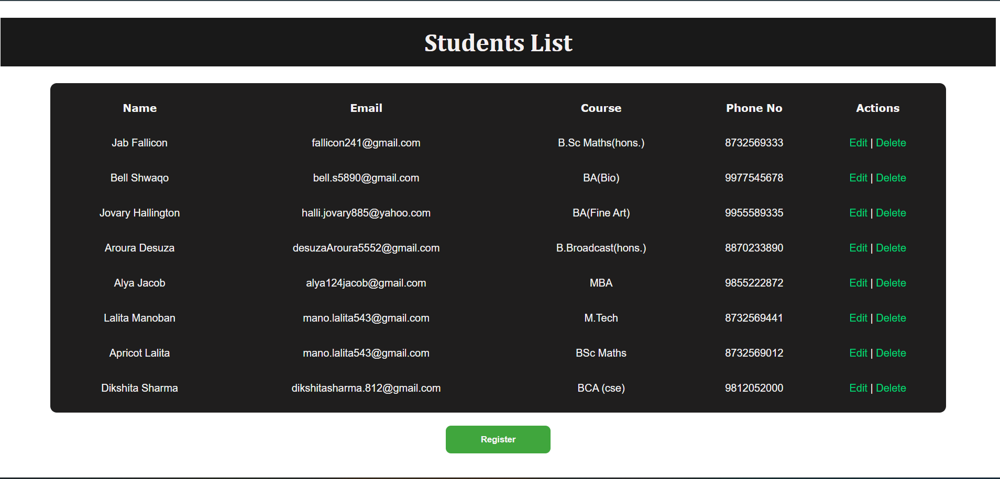
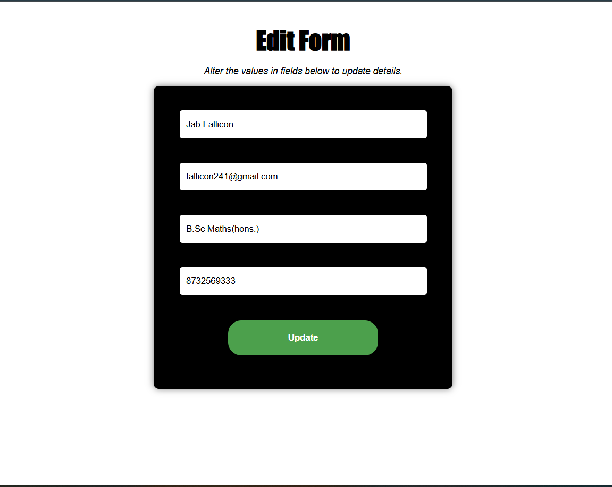

# Student Registration System

A PHP–MySQL based web application that allows students to register their details
and manage records using basic backend functionality.

This project focuses on implementing form handling, server-side validation, and
CRUD operations using Core PHP and MySQL.

---

## Features

- Student registration form
- Server-side input validation and sanitization
- Secure data storage using MySQL
- View registered student records
- Update student information
- Delete student records
- CRUD operations implemented with Core PHP

---

## Screenshots

### Student Registration Form

### Registered Students List

### Edit Student Details

---

## Tech Stack

- PHP (Core PHP)
- MySQL
- HTML5
- CSS3
- Apache (XAMPP / Localhost)

---

## How It Works

1. Students fill out the registration form with required details.
2. Input data is validated and sanitized on the server side.
3. Valid student records are stored in the MySQL database.
4. Registered students can be viewed in a structured list.
5. Student records can be updated or deleted as required.

---

## Purpose

This project was built to practice:
- PHP–MySQL integration
- Form handling and validation
- CRUD operations
- Structured backend logic

---

## Future Improvements

- Login and authentication system
- Session-based access control
- Search and pagination for student records
- Improved UI and form usability

---

## Author

**Dikshita**  
BCA Student | Backend Development (PHP & MySQL)
## Project Structure

